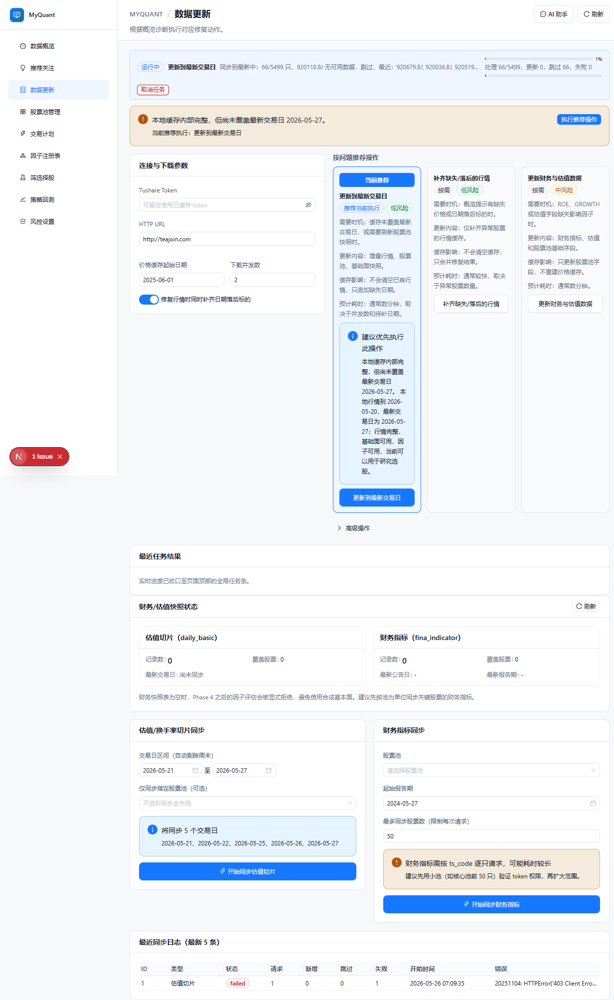
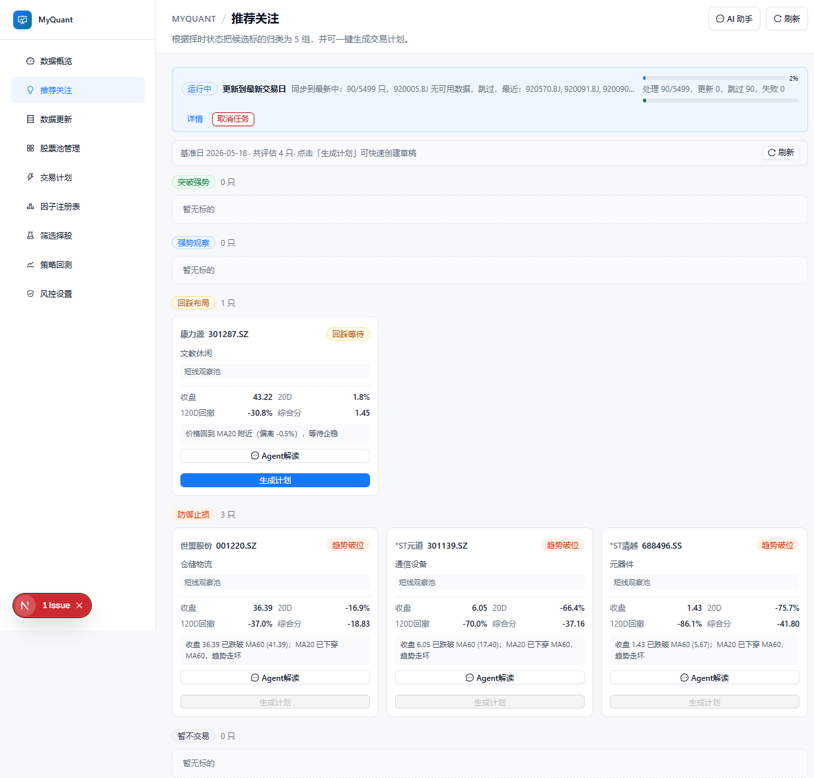
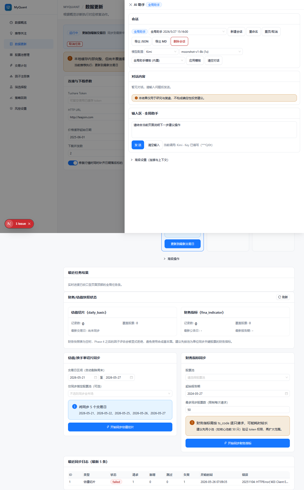

# MyQuant 股票小白快速入门

面向第一次接触量化工具的用户，这份文档只讲三件事：
1. 先看哪里
2. 先点什么
3. 怎么把分析变成可执行动作

---

## 1. 你会看到什么

进入系统后，左侧是功能菜单，右侧是当前页面内容。

建议先按这个顺序使用：
1. 数据更新
2. 推荐关注
3. 交易计划
4. 策略回测

这条路径最适合新手，因为它是从“先把数据准备好”到“再做决策”。

---

## 2. 第一步：先做数据更新（最重要）

在左侧点 数据更新，优先执行页面里的 推荐操作（例如 更新到最新交易日）。

你要关注两个信号：
1. 顶部进度条在推进
2. 页面提示没有明显失败信息

新手常见误区：
1. 数据没更新就去看选股结果，容易得到过时结论
2. 一次开太高并发，导致下载不稳定

建议：先用默认参数跑通一次，再逐步优化。

---

## 3. 第二步：看推荐关注（最容易上手）

在左侧点 推荐关注，可以看到系统按状态分组后的股票，例如 回踩布局、防御止损。

每个标的卡片里，重点看这几项：
1. 名称 + 代码
2. 当前状态（例如 回踩等待、趋势破位）
3. 简短解释（为什么被分到这一组）

你可以直接点：
1. Agent解读：让助手解释这个标的
2. 生成计划：把候选转成计划草稿

---

## 4. 第三步：用 AI 助手问人话问题

右上角点 AI 助手，先做会话和模型选择，再提问。

### 推荐提问模板（直接复制改词即可）
1. 这个页面现在最该先做哪一步，原因是什么？
2. 请用小白能懂的话解释这只股票为什么在 回踩布局。
3. 给我一个保守版交易计划，包含入场、止损、仓位建议。
4. 这只股票现在更像趋势延续还是反弹，给我 3 条判断依据。

### 小白使用原则
1. 先问为什么，再看结论
2. 让助手输出可执行项（入场条件、止损条件、失效条件）
3. 不要只看单次回答，至少追问 1 到 2 轮

---

## 5. 第四步：把结论落到 交易计划

当你在 推荐关注 或 AI 助手中拿到可执行观点后：
1. 生成计划 或 一键创建计划
2. 去 交易计划 页面检查字段是否完整
3. 补充你的个人约束（最大亏损、最大仓位、持有天数）

新手最低要求：
1. 每个计划都要有止损位
2. 每个计划都要有失效条件
3. 单笔仓位不要超过自己可承受范围

---

## 6. 10 分钟上手流程（照着做）

1. 打开 数据更新，执行 推荐操作
2. 等进度条完成或明显推进
3. 打开 推荐关注，挑 1 只看得懂的标的
4. 点 Agent解读，问 2 个问题：为什么、怎么做
5. 点 生成计划，去 交易计划 检查并补充风控

做到这一步，你就已经完成了一个最小可用投资研究闭环。

---

## 7. 风险提醒（务必看）

1. 任何模型结论都可能出错
2. 工具用于研究和复盘，不是收益保证
3. 先小资金、先验证流程，再扩大投入

---

## 8. 看不懂因子和策略怎么办

如果你看到“趋势斜率、回撤、低波动”这类词有点懵，可以直接看这份白话词典：

- [因子和策略白话手册](./因子和策略白话手册.md)

如果你愿意，我可以继续给你补一版：
1. 一页纸速查版（适合打印）
2. 常见报错自救版（例如 API Key、连接失败、无数据）
3. 交易前检查清单版（避免情绪化下单）
